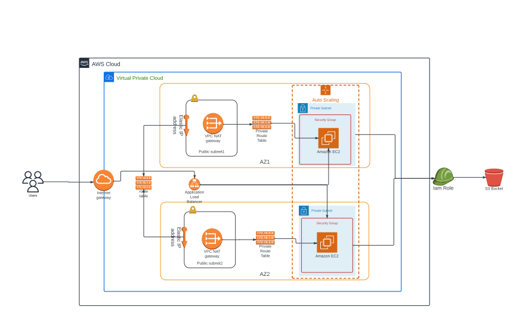

#  Deploying a high-availability web app using CloudFormation

## Problem Statement

My company is creating an Instagram clone called Udagram. Our Developers want to deploy a new application to the AWS infrastructure. You have been tasked with provisioning the required infrastructure and deploying a dummy application, along with the necessary supporting software. This needs to be automated so that the infrastructure can be discarded as soon as the testing team finishes their tests and gathers their results.

## Requirements
- AWS account
- AWS CLI

### Diagram of the Infrastructure


### Deployment Instruction for the Infrastructure
```
$ ./create.sh final project.yml netserver-parameters.json
```

### Deployed High Avaliabilty Application

### [http://works-WebAp-100JOWQJD590Q-729808301.us-east-1.elb.amazonaws.com](http://works-WebAp-100JOWQJD590Q-729808301.us-east-1.elb.amazonaws.com)


